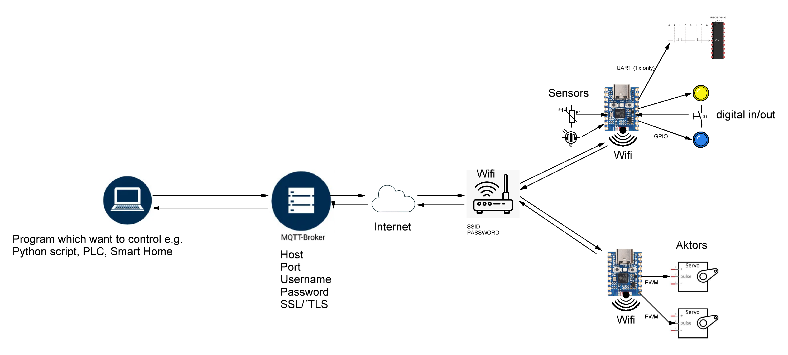
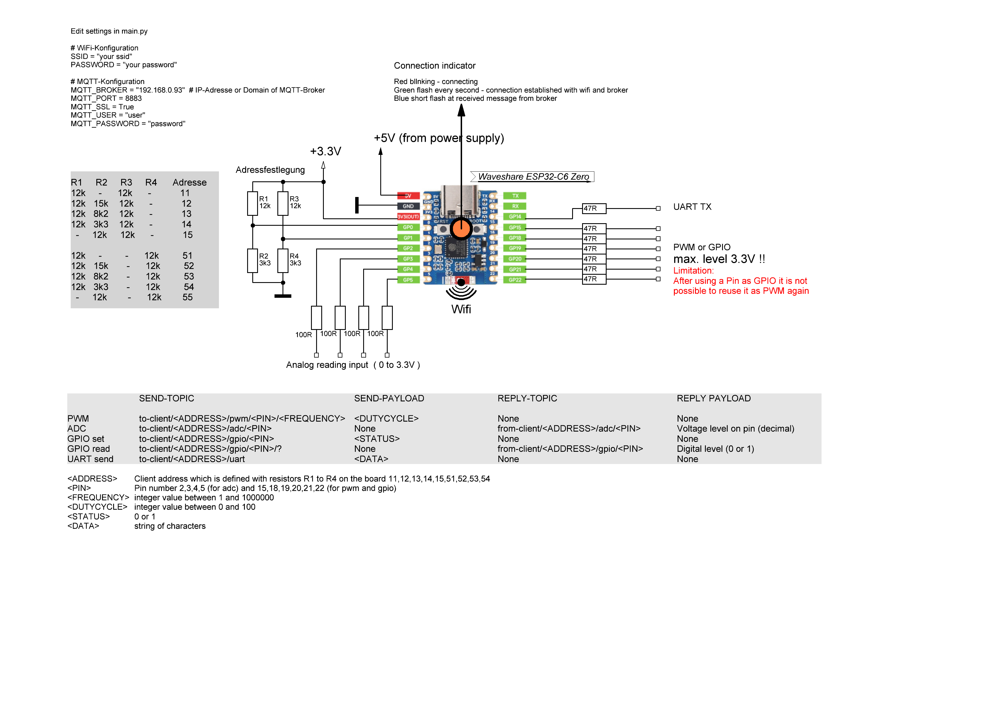

## ESP32 Remote Peripheral Control with MQTT
### Overview

### Detailed description

### Install
- Flash micropython version **1.25.0** for ESP32-C6 to the board.     
Please not again: At the moment of the project status you must use 1.25.0    
You can use the Thonny tool from here https://thonny.org/ to flash the ESP32.     
- Copy adc.py, boot.py, gpio.py and main.py into the root of the ESP32-C6.   
Note: Only ESP32-C6 is tested. Maybe it is running on other ESP32 cannot be guaranteed.    
#### Limitations
After using pin as gpio output it cannot be reused as pwm pin  

